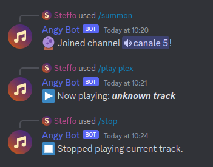

#  Angy Bot

Music player bot for Discord supporting unusual formats and features, intended for use in the [RYG community](https://www.ryg.one/).

> **Warning**
>
> Very hastily developed with no regards to security or code quality, use it at your own risk!

## Links

*No links available right now.*

## Screenshots

## Features

Currently supports playing from:

- local filesystem
- yt-dlp
- local Plex instance

> **Warning**
> 
> The bot currently supports only the playback of a single track at a time.

## Commands

The bot registers the following Slash Commands:

- `/summon channel:...` · Makes the bot connect to a channel
- `/play file what:...` · If you are the bot owner, plays the file at the given path.
- `/play ytdl what:...` · Tries to download and play the given string with yt-dlp, falling back to `ytsearch:` if it is not a valid URL.
- `/play plex what:...` · Queries a Plex Media Server for a track name, and plays the first result returned.
- `/stop` · Stops playback of any track.

## Installation

Use the provided Docker image:

- [`ghcr.io/ryghub/angybot`](https://github.com/RYGhub/angybot/pkgs/container/angybot)

The following environment variables must be set to configure the bot:

- `ANGY_TOKEN` · The Discord bot token to use.
- `ANGY_APPID` · The Discord application id to use.
- `ANGY_PLEX_SERVER` · The Plex server to use.
- `ANGY_PLEX_TOKEN` · The Plex token to use.
- `ANGY_PLEX_LIBRARY` · The Plex library to use.
- `ANGY_PLEX_REPLACE_FROM` · The string to remove from the media file path for Plex files.
- `ANGY_PLEX_REPLACE_TO` · The string to add in the media file path for Plex files.
- `ANGY_DEV_GUILD_ID` · The guild id to register Slash Commands in.
- `ANGY_DEV_USER_ID` · The user id allowed to use `/play file`.
